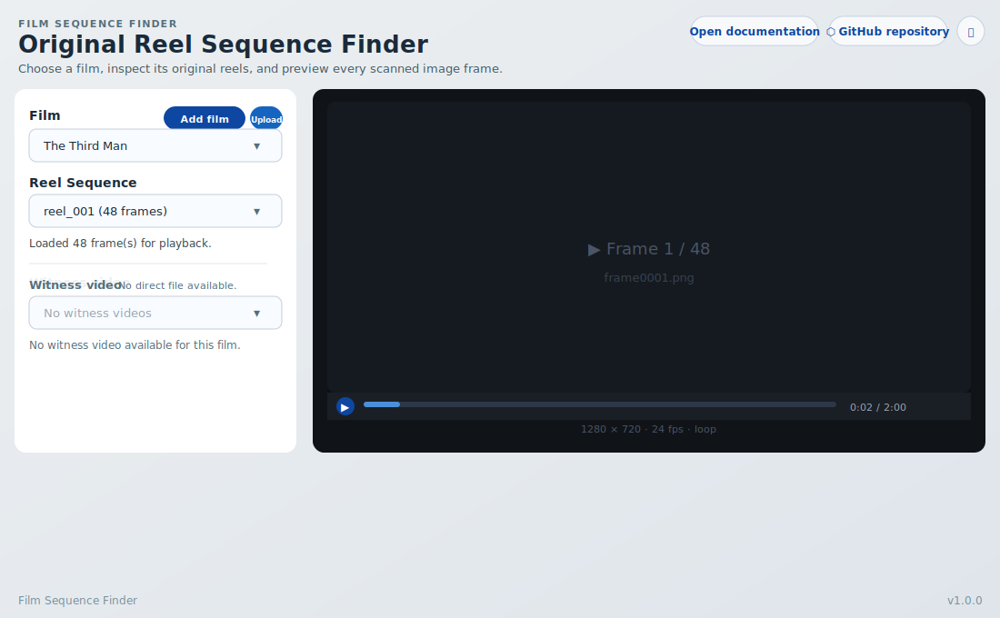

# 4.1 Film Browser

The Film Browser is the main interface of Film Sequence Finder.
It lets you select a film, pick a reel sequence, and preview every scanned
image frame in the built-in Remotion player.



## Interface overview

The page is divided into two panels:

| Panel | Purpose |
| ----- | ------- |
| **Selection panel** (left) | Choose a film, a reel sequence, and manage witness videos. |
| **Preview panel** (right) | Remotion player that plays back the frame sequence. |

The header contains links to the documentation site, the GitHub repository,
and a shortcut to create a new issue.

## Step-by-step usage

### 1. Start both services

Start the FastAPI server from the `server` folder:

```bash
cd server
uvicorn app.main:app --reload --host 0.0.0.0 --port 8000
```

Start the Vite frontend:

```bash
cd frontend
pnpm dev
```

Open the webapp at `http://localhost:5173` (dev) or `http://localhost:3000`
(Docker stack).

### 2. Select a film

The **Film** drop-down lists every film folder found under `FILM_LIBRARY_ROOT`.
Films are displayed using a human-readable name derived from the folder name
(underscores replaced by spaces, title-cased).

Click the drop-down and choose the film you want to inspect.

### 3. Select a reel sequence

Once a film is selected, the **Reel Sequence** drop-down is populated with
every subfolder found inside the film directory.
Each entry shows the reel folder name and its frame count.

Click the drop-down and choose the reel you want to preview.

### 4. Play the frame sequence

The Remotion player in the right panel loads the frames and enables playback:

| Control | Action |
| ------- | ------ |
| **▶ / ⏸** | Play or pause the sequence. |
| **Progress bar** | Click or drag to scrub to a specific frame. |
| **Loop** | The sequence replays automatically when it reaches the last frame. |
| **Full-screen** | Expand the player to fill the viewport. |

The status line below the reel selector confirms the number of frames loaded.

## Troubleshooting

| Symptom | Likely cause | Fix |
| ------- | ------------ | --- |
| No films shown | `FILM_LIBRARY_ROOT` is empty or not found. | Verify the `FILM_LIBRARY_ROOT` env variable and that the path contains film folders. |
| No reels shown | The film directory contains no subfolders. | Add at least one reel subfolder inside the film directory. |
| Player shows "No frame available" | The reel folder contains no recognised image files. | Add `.png`, `.jpg`, `.jpeg`, or `.webp` files with names that sort alphabetically in playback order. |
| Frames appear in wrong order | Frame filenames do not sort correctly. | Rename files with zero-padded numbers (e.g. `frame0001.png`, `frame0002.png`). |
