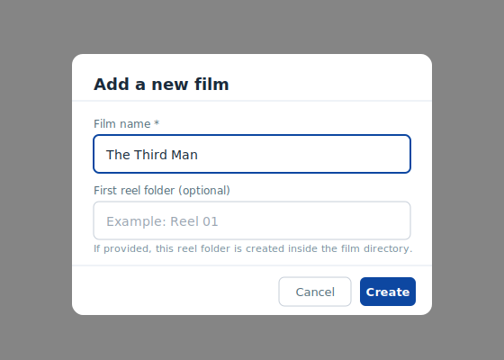

# 4.3 Film Management

Film Management covers the operations that create and organise films in the
film library.
These operations act directly on the filesystem via the FastAPI backend —
no database is involved.

## Adding a film

Click the **Add film** button in the selection panel to open the
**Add a new film** dialog.



### Dialog fields

| Field | Required | Description |
| ----- | -------- | ----------- |
| **Film name** | Yes | Human-readable name for the film (e.g. `The Third Man`). Must be at least 2 characters. |
| **First reel folder** | No | If provided, a reel subfolder is created inside the new film directory. |

### Film ID derivation

The film name you enter is normalised to produce a filesystem-safe folder name:

1. The name is lower-cased.
2. Any sequence of non-alphanumeric characters is replaced by a single `_`.
3. Leading and trailing underscores are stripped.

| Display name | Derived folder name |
| ------------ | ------------------- |
| `The Third Man` | `the_third_man` |
| `Citizen Kane` | `citizen_kane` |
| `2001: A Space Odyssey` | `2001_a_space_odyssey` |

### After creation

Once the film is created successfully:

- The film drop-down refreshes and automatically selects the new film.
- A success notification appears at the top of the page.

If a film with the same derived ID already exists, a `409 Conflict` error is
shown and no directory is created.

## Film dataset location

Films are stored inside `FILM_LIBRARY_ROOT` (default: `server/data/films/`):

```text
server/data/films/
  the_third_man/
    reel_001/
      frame0001.png
      frame0002.png
    _witness_videos/
      witness_clip.mp4
```

You can also add film and reel directories manually by creating folders that
follow this layout — they will appear in the film selector on the next page load.
