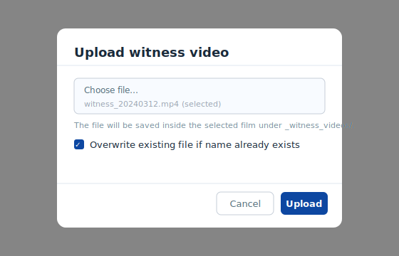
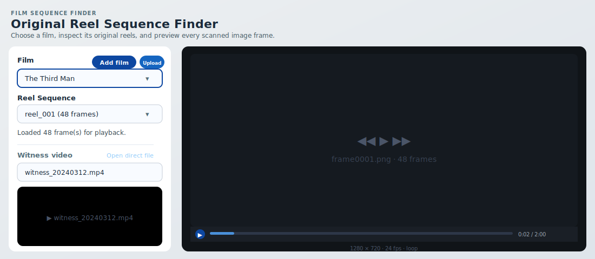
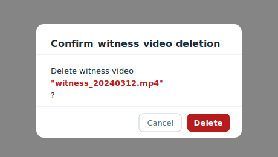

# 4.4 Witness Video Management

A **witness video** is a reference video file associated with a film.
It is stored inside the film directory under the `_witness_videos/` subfolder
and can be played back in the preview panel alongside the reel frame sequence.

## Uploading a witness video

Click the **Upload witness video** button in the selection panel to open the
upload dialog.



1. Select the target film in the film drop-down (the button is disabled when no
   film is selected).
2. Click **Upload witness video**.
3. Click **Choose file** and select a video file from your computer.
   Supported formats: `.mp4`, `.mov`, `.m4v`, `.webm`, `.avi`, `.mkv`.
4. (Optional) Enable **Overwrite existing file if name already exists** to
   replace a previously uploaded file with the same name.
5. Click **Upload**.

On success:

- The witness video selector refreshes and selects the newly uploaded video.
- A success notification confirms the upload.

The file is stored at:

```text
FILM_LIBRARY_ROOT/<film_id>/_witness_videos/<filename>
```

## Playing a witness video

Once a witness video is uploaded and selected, it appears in the
**Witness video** panel below the Remotion player.



Use the browser's native video controls to play, pause, and seek the
witness video. The **Open direct file** link opens the raw media URL
in a new browser tab.

## Switching between witness videos

Use the **Witness video** drop-down to switch between multiple witness
videos uploaded for the same film.

## Deleting a witness video

1. Select the witness video you want to remove from the drop-down.
2. Click **Supprimer la vidéo témoin sélectionnée** (Delete selected witness video).
3. Confirm the deletion in the confirmation dialog.



!!! warning
    Deletion is permanent. The file is removed from the filesystem and
    cannot be recovered through the UI.

## Notes

- The **Upload witness video** button is disabled when no film is selected.
- Witness videos are not required — the reel frame preview works independently.
- The `_witness_videos/` folder is excluded from reel listings because it
  does not follow the `<reel_id>/<frame>` convention.
